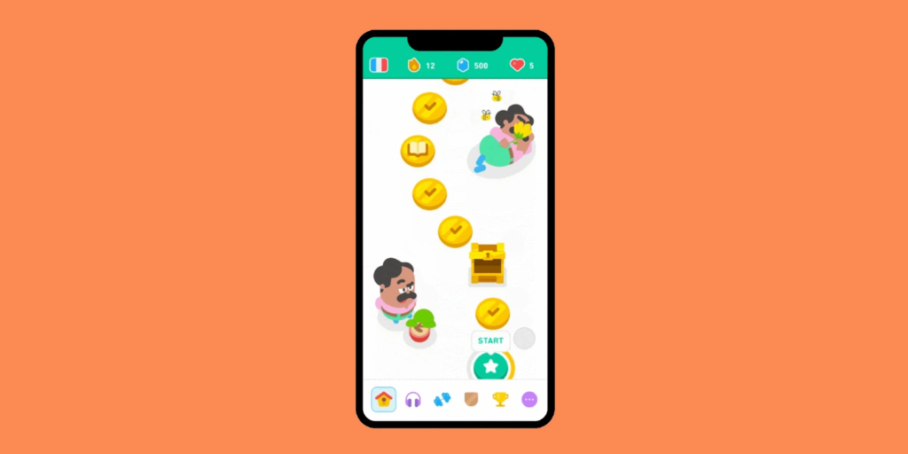

# SpeechEase 🦜

SpeechEase is an AI-powered conversational partner and speech coaching companion designed to help users prepare for interviews, public speaking, and daily presentations. It delivers a real-time, low-latency conversational experience with diagnostic feedback.

---

## 🎨 Design Vision & Brand Identity

* **UI Style**: Inspired by the conversational flow and feel of **Gemini Live**, tailored for native iOS.
* **Color Palette**: Modern, high-contrast, premium interface highlighting **vibrant oranges and warm yellows**.
* **Mascot**: An orange parrot (the master of vocal speech and mimicry) guiding the user through the learning journey.

---

## 🚀 Core Features

### 1. Learn Journey (Duolingo-Style Path) 🛣️
Selecting any speech topic (e.g., Vocal Variety, Body Language) opens an interactive, step-by-step learning path. Users progress sequentially through lessons, unlocking milestones, quizzes, and exercises.

#### Design Inspiration:

---

### 2. Metrics & Gamification Bar 🏆
The top of the dashboard displays core user performance statistics at a glance, motivating daily practice:
* **Streak**: Consecutive days practiced.
* **Speech Score**: Aggregated indicator of fluency, pitch control, and confidence.
* **Hearts/Lives**: Progression gating metrics.

#### Design Inspiration:

---

### 3. Gemini Live Practice Arena 🎙️
An interactive practice environment where users configure custom mock interviews and presentations:
* **Custom Roles**: Choose or define target professions/scenarios (e.g., iOS Engineer, Product Manager, Keynote Speaker).
* **Question Limits**: Set the number of interview prompts.
* **Gemini Dialogues**: Gemini asks questions, listens to speech input, handles interrupts, and dynamically chooses to either ask follow-up questions or proceed.
* **Hiring Likelihood Score**: Post-interview analysis providing an objective percentage indicating recruitment likelihood along with speech metrics and suggestions.

---

## 📁 Project Architecture (Single Responsibility Principle)

To keep code clean and scalable, files are divided by function:
* `Models/`: Standard data models and schemas (e.g., `LearnTopic.swift`).
* `UIComponents/`: Reusable interface objects (e.g., `ProgressRing.swift`).
* `Features/`: Scope-specific components grouped by app features:
  * `Features/Learn/`: Files related to lessons and paths (`LearnView.swift`, `LearnTopicCard.swift`, `TopicDetailView.swift`).
  * `Features/Practice/`: Real-time voice and role interaction views.
  * `Features/Progress/`: Analytics and performance summaries.
